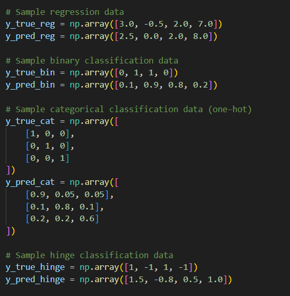
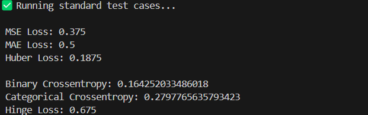
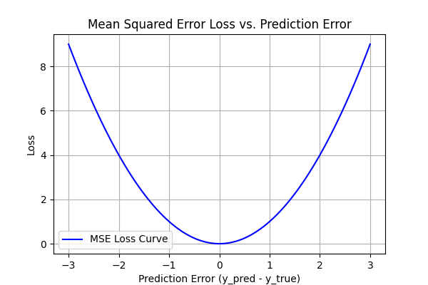
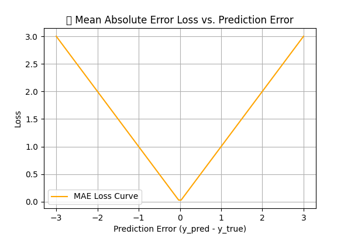
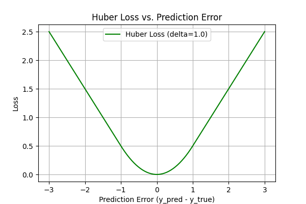
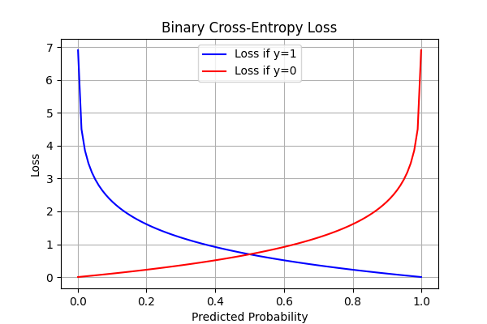
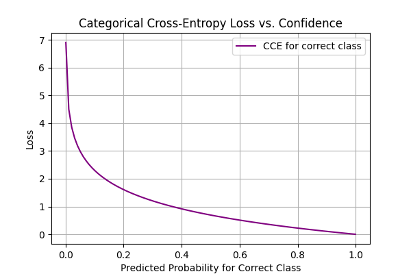

# 🔍 Machine Learning Loss Functions

> 📘 Educational Project: This repository is for educational purposes only.
> It demonstrates the theory, implementation, and visualization of common ML loss functions using Python and NumPy.

This project implements and visualizes essential loss functions used in Machine Learning, both for **regression** and **classification**. Each loss is covered with:

- 📌 Mathematical formula & explanation
- 🧠 Gradient derivation
- 🧪 Code implementation (from scratch using NumPy)
- 📊 Visualizations of the loss curve
- 🧾 Use-case and comparison documentation

---

## 📁 Folder Structure
ml-loss-functions/

├── regression/ # MSE, MAE, Huber

├── classification/ # BCE, CCE, Hinge

├── graphs/ # All generated visualizations

├── utils/ # Unified test runner

├── report.md # In-depth theoretical report

├── README.md # Project overview

└── requirements.txt # Dependencies


---

## 🧪 🔍 Test Case Demonstration

This project includes a script (`Utils/test_cases.py`) that runs all implemented loss functions on various sample inputs to demonstrate correctness and usability.

### 📥 Test Input


> ✅ This image shows sample test cases including different predictions and labels across both regression and classification loss functions.

### 📤 Test Output


> 🎯 The above output reflects the computed loss values and gradients printed for each function when the script is run. This helps validate the implementation with real data.

> 🧪 Run the test script using:
```bash
python Utils/test_cases.py

```


---

## 📚 Loss Functions Covered

| Category         | Loss Function            | File                              |
|------------------|--------------------------|-----------------------------------|
| Regression       | Mean Squared Error (MSE) | `regression/mse.py`               |
|                  | Mean Absolute Error (MAE)| `regression/mae.py`               |
|                  | Huber Loss               | `regression/huber.py`             |
| Classification   | Binary Cross-Entropy     | `classification/binary_crossentropy.py` |
|                  | Categorical Cross-Entropy| `classification/categorical_crossentropy.py` |
|                  | Hinge Loss               | `classification/hinge.py`         |


## 📊 Loss Function Visualizations

### 🔹 MSE


### 🔹 MAE


### 🔹 Huber Loss


### 🔹 Binary Cross-Entropy


### 🔹 Categorical Cross-Entropy


### 🔹 Hinge Loss


---

## 🚀 Running the Project

1.  Install dependencies:

```bash
pip install -r requirements.txt
```

2.  python utils/test_cases.py

3.  Check graphs/ folder for all visualizations

4. Check report.md for:

   Full math derivations

   Gradient explanations

   When to use which loss

   Visual graph insights

##  Author
Chakshu Sharma

🎓 B.Tech CSE | AI-ML Enthusiast

📅 Project Timeline: June–July 2025

📌 Focus: Concept clarity + code implementation
